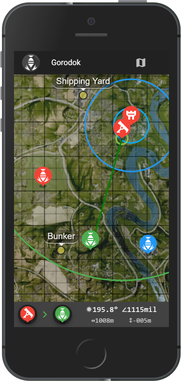

# PostScriptumMC - The map-based mortar calculator for Squad44

PostScriptumMC is a map-based mortar elevation and bearing calculator for the game [*Squad44*](http://joinsquad44.com/), formerly known as Post Scriptum.



## Links

* **Current version: https://psmc.michalletavka.cz/**
* Original version, for the game [*Squad*](http://joinsquad.com/): **https://squadmc.ende.pro/**
  * From repository https://github.com/Endebert/squadmc
* Map files are stored in another repository: https://github.com/michalletavka/squadmc-maps

## Features
* Highly accurate elevation and bearing calculation, using heightmaps and mortar shell trajectory function
* Optimized for mobile
* Quick placement and dragging of mortar, target, and FOB markers
* Supports multiple mortar, target, and FOB markers, and allows switching between them
* Min & max mortar range indication
* Max build range and min distance to next FOB indication
* Keypad grid (toggleable)
* Keypad coordinates calculation
* Location markers (toggleable)
* Visible heightmap (toggleable)
* Orthomaps/satellite maps (toggleable)

## Changelog
* See [Changelog](CHANGELOG.md)

## Installation

### Installation Prerequisites

* you need a recent NodeJS version installed on your machine. Get it [here.](https://nodejs.org/en/)
* install yarn for a faster installation:
  ```
  npm install -g yarn
  ```

### Cloning repository & installing dependencies

```
git clone https://github.com/michalletavka/squadmc
cd squadmc
yarn install
```

### Running development mode

For development mode with hot-reload, execute:
```
yarn run serve
```

### Building production version

For an optimized build ready for deployment, execute:
```
yarn run build
```
The build will be contained in the `/dist` folder.

## Code of Conduct
* See here: [Code of Conduct](CODE_OF_CONDUCT.md)

## Contributors
* Become one!

## Attributions
* Original Post Scriptum Mortar Calculator https://psmc.ende.pro/ by https://github.com/Endebert
* Maps © [Offworld Industries](http://joinsquad44.com/), powered by https://leafletjs.com/
